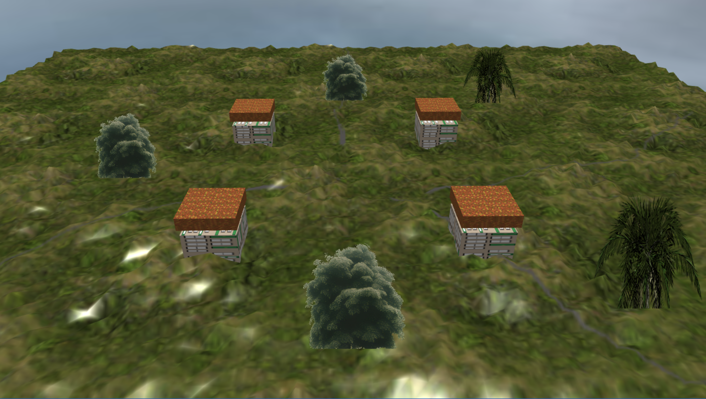
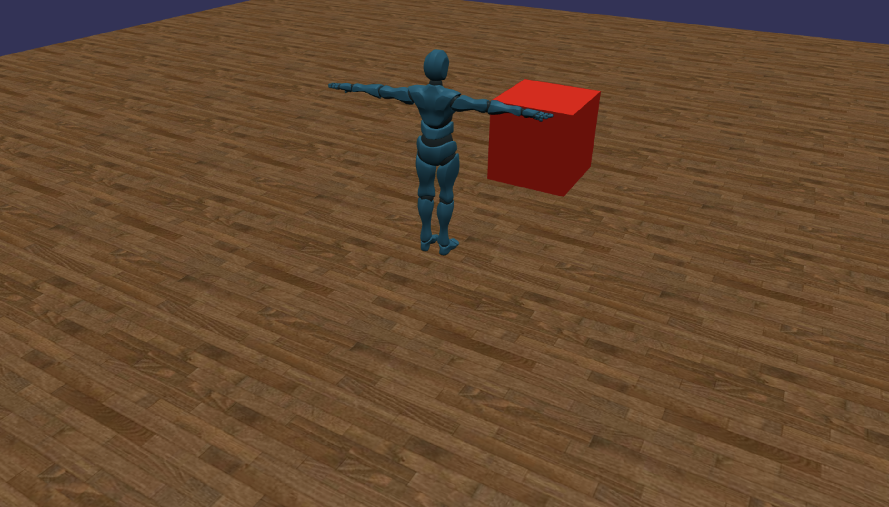
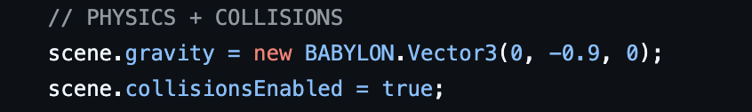
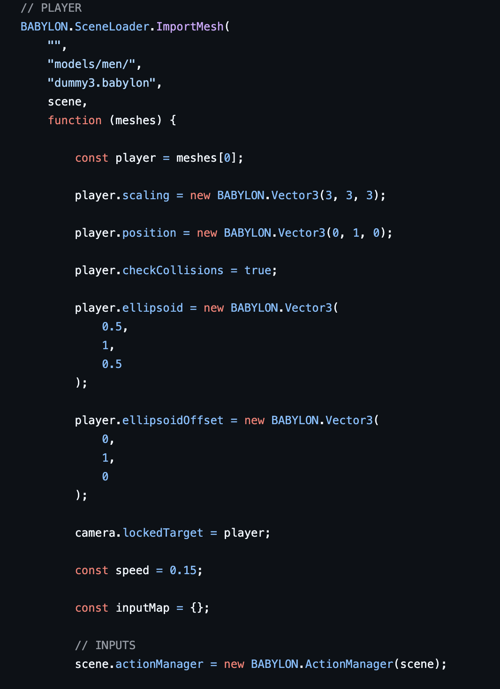
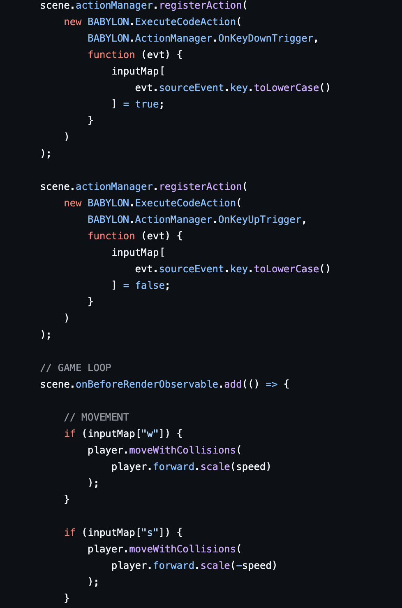
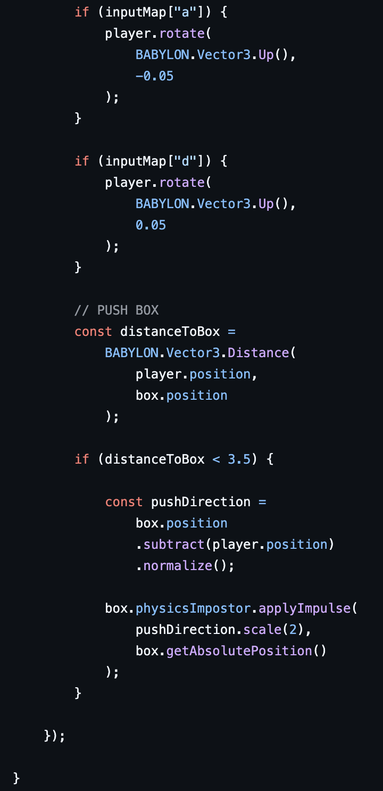
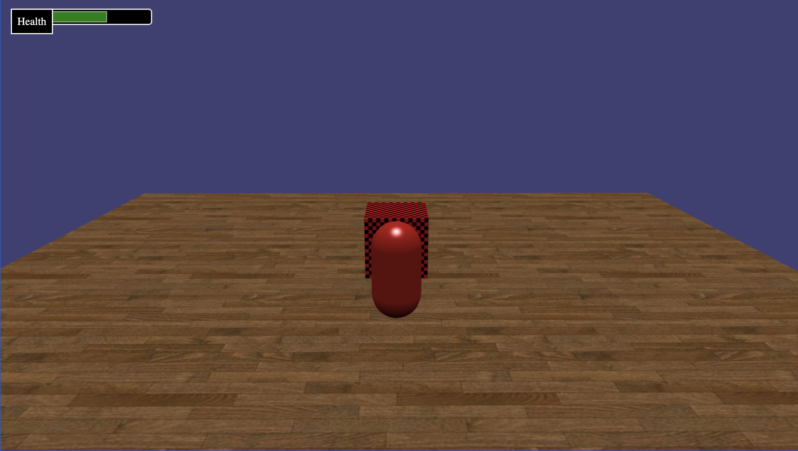
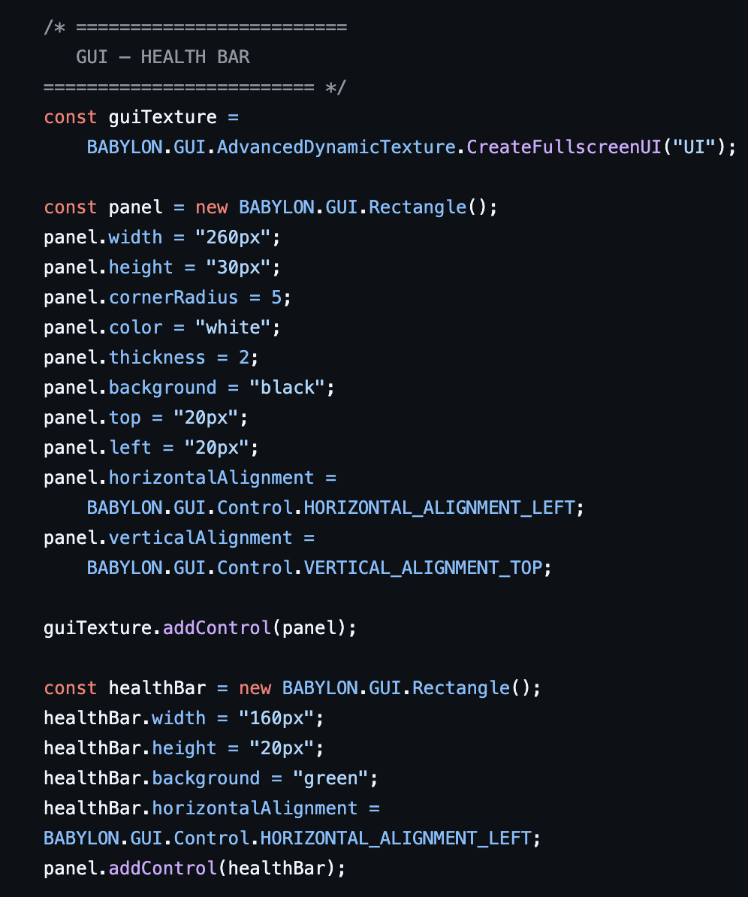

Babylon.js Coursework Documentation

Introduction:

This coursework project was developed using Babylon.js to create interactive 3D environments inside a web browser. Each element introduced new features such as textures, terrain, physics, collisions, imported models, and player interaction systems.

The project was built using:

* HTML
* JavaScript
* Babylon.js

  Element 1 – Basic Shapes and Scene Setup

Aim

The aim of Element 1 was to create a simple Babylon.js scene using primitive meshes, textures, lighting, shadows, and animation.

Features

* ArcRotateCamera
* Directional lighting
* Shadows
* Textured ground
* Cube and sphere meshes
* Animation system
  
Final Scene:

Scene Setup Code

Babylon.js engine and scene setup with custom background colour.

Camera and Lighting:

ArcRotateCamera and directional lighting used to control the scene view and create shadows.

Result:
Element 1 successfully demonstrates basic Babylon.js scene creation, textures, lighting, shadows, and animation.

Element 2 – Environment Creation
Aim:
The aim of Element 2 was to create a larger outdoor environment using terrain, skyboxes, houses, and sprites.

Features:
* Height map terrain
* Sky environment
* Tree and palm sprites
* Multiple houses
* Improved camera controls

Final Scene

Large outdoor environment created using terrain, houses, trees, and sky textures.

Height map terrain used to create hills and landscape variation.

Sprites and Environment

SpriteManager used for trees and environmental objects to improve performance.

Element 3 – Interaction and Physics
Aim:
The aim of Element 3 was to implement collisions, physics, imported models, player movement, and object interaction.

Features:

* Physics engine
* Follow camera
* Imported player model
* Collision systems
* Keyboard movement
* Pushable physics box

Final Scene:

Physics and Collisions:

Gravity and collision detection were added so the player and objects can interact properly.

Character Import and Movement:

Movement Controls:

Keyboard input was added using ActionManager to move and rotate the player.

Push Box Physics:

The player can push the physics box when close enough using impulses and collision detection.

Result

The interaction system was successful because the player can move smoothly using keyboard controls and interact with physics objects in real time. Gravity and collision detection helped create a more realistic environment, while the push box mechanic demonstrated working physics interactions using impulses.

Element 4 – GUI, Audio, Logic

This element demonstrates GUI systems, movement logic, jumping, and health mechanics using Babylon.js.

Final Scene:

GUI – Health Bar:

A GUI health bar was created using Babylon GUI controls. The health bar updates dynamically during gameplay.
Movement and Jump Logic:

Keyboard input was implemented for movement and jumping using collision detection and gravity.
Health / Damage Logic:

The player loses health when colliding with the obstacle, and the GUI health bar updates in real time.

Result:
The GUI and gameplay systems worked successfully. The player could move, jump, collide with objects, and lose health dynamically while the health bar updated correctly on screen.

